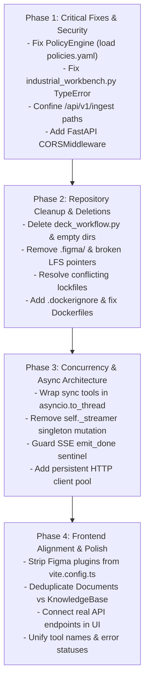

# Repository Code Audit & Remediation Guide

**Target Repository:** `AgenticAI-Workbench`  
**Scope:** `backend/`, `frontend/`, `sandbox/`, `configs/`, `scripts/`, Docker & Infrastructure (excluding `tests/`)  
**Audit Focus:** Bad practices, security vulnerabilities, performance bottlenecks, architecture anti-patterns, and removal/cleanup candidates.

---

## Table of Contents

1. [Executive Summary](#1-executive-summary)
2. [What Should Be Removed (Dead Code & Cleanup Candidates)](#2-what-should-be-removed-dead-code--cleanup-candidates)
3. [Critical Bugs & Security Vulnerabilities](#3-critical-bugs--security-vulnerabilities)
4. [Concurrency, Performance & Event Loop Blocking](#4-concurrency-performance--event-loop-blocking)
5. [Code Quality, Architectural Flaws & Anti-Patterns](#5-code-quality-architectural-flaws--anti-patterns)
6. [Frontend Disconnect & Figma Make Scaffolding Issues](#6-frontend-disconnect--figma-make-scaffolding-issues)
7. [Docker & Build Infrastructure Deficiencies](#7-docker--build-infrastructure-deficiencies)
8. [Prioritized Remediation Roadmap](#8-prioritized-remediation-roadmap)

---

## 1. Executive Summary

A comprehensive architectural and static code audit was conducted across the `AgenticAI-Workbench` repository. The codebase demonstrates strong conceptual domain design (sovereign execution, air-gapped LLM routing, sandboxed code execution, OpenXML/PDF artifact generation), but suffers from several severe production risks:

- **Security bypasses:** Human approval checks are completely deactivated in code (`approval_tools = set()`), arbitrary file ingestion is permitted via `/api/v1/ingest`, and `MockSandboxExecutor` executes untrusted code uncontained on the host.
- **Runtime crashes:** A type mismatch bug in `backend/agents/industrial_workbench.py` will crash code-fallback artifact generation with a `TypeError`.
- **Event loop starvation:** Heavy synchronous operations (Docker runs, Tesseract OCR, PyMuPDF page rendering, LibreOffice subprocesses, and ONNX embeddings) are called directly inside `async def` FastAPI routes and tools, freezing the server for concurrent users.
- **Race conditions:** Singleton services store per-request state on `self` (`AgentRuntime._streamer = streamer`), causing event stream leakage between concurrent requests.
- **Dead code and scaffolding pollution:** Obsolete stubs (`deck_workflow.py`), empty directories, conflicting package managers (npm vs pnpm), broken Git LFS pointers, duplicate pages, and 300+ lines of vendor-specific Figma Make preview code clutter the repository.

---

## 2. What Should Be Removed (Dead Code & Cleanup Candidates)

The following files, directories, and artifacts are either completely unreferenced, redundant, or leftover development artifacts:

### 2.1. Backend Dead Code & Unused Modules

| File / Path | Reason for Removal |
| :--- | :--- |
| `backend/artifacts/deck_workflow.py` | **100% Dead Stub:** Defines `CodeDeckWorkflow` which returns a hardcoded fake completed result (`status="completed"`). It is never imported or called anywhere in the application. |
| `backend/db/` | **Empty package:** Contains only an empty `__init__.py` (`"""Persistence adapters."""`). No database or persistence layer exists here. |
| `prompts/` | **Empty directory:** Contains only `.gitkeep`. Prompts are defined in Python code and `configs/agents.yaml`. |
| `templates/approval_notes/`, `templates/docx/`, `templates/pptx/` | **Empty directories:** Contain only `.gitkeep`. Generators build documents programmatically without template files; `templates/` is unreferenced in code. |

### 2.2. Frontend Vendor Artifacts & Scaffolding Junk

| File / Path | Reason for Removal |
| :--- | :--- |
| `frontend/.figma/` (entire directory) | **Figma Make internal scripts:** Contains 9 utility scripts (`analyze-routes`, `deploy`, `deploy-preview`, `dev`, `format`, `install`, `langserver`, `site.json`, `dev.json`) generated by Figma's web IDE. They are useless outside Figma's proprietary container environment. |
| `frontend/src/assets/reference.png` | **Broken Git-LFS pointer:** A 131-byte text pointer (`version https://git-lfs.github.com/...`) that was never resolved. Not imported or rendered anywhere. |
| `frontend/src/imports/Screenshot_2026-09-18_225350.png` | **Duplicate broken Git-LFS pointer:** Exactly identical SHA256 pointer as `reference.png`. Unreferenced in code. |
| `frontend/CLAUDE.md` & `frontend/AGENTS.md` | **Figma Make boilerplate documentation:** Describes running a development server on `$PORT 8443` inside Figma Make, confusing developers working on the Workbench. |
| One of `frontend/pnpm-lock.yaml` or `frontend/package-lock.json` | **Conflicting lockfiles:** Committing both npm and pnpm lockfiles causes non-deterministic dependency installations and cache conflicts in CI/CD. Standardize on one (e.g., npm or pnpm). |
| `frontend/src/pages/Documents.tsx` | **Duplicate page:** `Documents.tsx` and `KnowledgeBase.tsx` are near-identical duplicates implementing the same search, filter, preview, and mock upload. Keep one and remove the other. |

### 2.3. Root & Sandbox Ad-hoc Files

| File / Path | Reason for Removal / Relocation |
| :--- | :--- |
| `sandbox/example_deck.py` | **Loose demo script:** A standalone script in the sandbox root that executes without isolation and outputs `example_deck.pptx` into the current working directory. Move to an `examples/` folder if needed. |
| `sandbox/test_helpers.py` | **Misplaced test script:** A test suite placed in `sandbox/` instead of `tests/` that leaves uncleaned `.pptx`, `.docx`, and `.pdf` files in the repository root. |
| `reset-local-data.ps1` & `start-local.ps1` in repo root | **Root clutter & OS bias:** Windows PowerShell scripts sitting in root without Linux/macOS bash equivalents. Move to `scripts/` and provide cross-platform shell scripts. |

---

## 3. Critical Bugs & Security Vulnerabilities

### 3.1. Policy Engine Bypassed: Human Approval Disabled in Code
- **File:** `backend/security/policy.py:17`
- **Issue:** Commit `be38623` ("temporary removed human approval") set `approval_tools = set()`.
- **Impact:** The application policy engine evaluates every tool invocation as `PolicyDecision.ALLOW`. Sensitive actions—such as executing arbitrary Python scripts in the sandbox (`sandbox.execute`), creating documents (`document.create`), or writing files (`file.write`)—execute immediately without human confirmation. Furthermore, `configs/policies.yaml` is never loaded or applied.
- **Remediation:** Load the active approval policy from `configs/policies.yaml` and initialize `approval_tools` properly.

### 3.2. Runtime Crash (`TypeError`) in Artifact Code Fallback
- **File:** `backend/agents/industrial_workbench.py:415`
- **Code:**
  ```python
  match = re.search(r"```(?:python)?\s*(.*?)\s*```", model_response, re.DOTALL | re.IGNORECASE)
  ```
- **Issue:** `model_response` is an instance of `ModelResponse` (defined in `backend.models.contracts`), not a `str`.
- **Impact:** Passing an object to `re.search` raises `TypeError: expected string or bytes-like object, got 'ModelResponse'`. If a model returns code within markdown fences instead of calling a structured tool, the server crashes with a 500 error instead of harvesting the code.
- **Remediation:** Change `model_response` to `model_response.content`.

### 3.3. Arbitrary Host Filesystem Ingestion via `/api/v1/ingest`
- **File:** `backend/api/routes.py:390-392`
- **Code:**
  ```python
  path = Path(payload.file_path)
  if not path.exists():
      raise HTTPException(status_code=404, detail=f"File not found: {payload.file_path}")
  ```
- **Issue:** Unlike `/tasks` which uses `_resolve_inside(uploads_dir, ...)`, `/api/v1/ingest` accepts any arbitrary file path on the host system.
- **Impact:** An attacker or unauthorized caller can point the endpoint to sensitive system files (e.g., `/etc/passwd`, `/etc/shadow`, environment configurations, SSH keys) and force the system to OCR, chunk, and index those contents into the searchable vector store.
- **Remediation:** Sanitize and restrict `payload.file_path` using `_resolve_inside` or restrict ingestion strictly to `uploads_dir`.

### 3.4. Insecure Host Execution in `MockSandboxExecutor`
- **File:** `backend/sandbox/executor.py:372-378`
- **Code:**
  ```python
  proc = subprocess.run(command, cwd=str(workspace), capture_output=True, text=True, timeout=request.timeout_seconds or 30)
  ```
- **Issue:** When Docker is unavailable, `build_executor()` silently falls back to `MockSandboxExecutor`. This executor runs untrusted LLM-generated Python code directly on the host machine using `sys.executable`.
- **Impact:** Untrusted model-generated code can delete files, read environment secrets, spawn reverse shells, or compromise the host server.
- **Remediation:** Either disable the fallback in production (`sovereign_mode=True` should refuse to run code without Docker container isolation) or add an explicit `allow_unisolated_fallback` flag that errors out by default.

### 3.5. Overly Permissive File Permissions (`chmod 0o777` / `0o666`)
- **File:** `backend/sandbox/executor.py:250, 259, 274, 283, 289, 301`
- **Issue:** The executor blindly sets `0o777` and `0o666` permissions on workspaces and entry files in an attempt to handle Docker UID mapping issues.
- **Impact:** Creates world-writable directories and files in `/tmp` or shared host mounts, exposing the system to symlink attacks and race conditions on multi-user systems.
- **Remediation:** Set appropriate POSIX permissions (`0o750` / `0o640`) and align container UID/GID properly via Docker run parameters.

### 3.6. Missing CORS Middleware in FastAPI Application
- **File:** `backend/main.py`
- **Issue:** FastAPI is instantiated without `CORSMiddleware`. Only `/tasks/stream` manually attaches an `Access-Control-Allow-Origin: *` response header.
- **Impact:** Browsers running the frontend on port 5173, 8443, or 3000 will be blocked by CORS policy when attempting to call `/api/v1/health`, `/api/v1/tasks`, `/api/v1/artifacts`, or `/api/v1/ingest`.
- **Remediation:** Add `CORSMiddleware` in `backend/main.py` with configurable allowed origins.

---

## 4. Concurrency, Performance & Event Loop Blocking

### 4.1. Heavy Synchronous Blocking Operations in Async Handlers
FastAPI relies on an `asyncio` event loop running on a single thread. Calling synchronous, blocking I/O or CPU-intensive tasks inside an `async def` route stops the entire event loop, freezing all concurrent HTTP requests and SSE streams.

| Location | Synchronous Call | Impact |
| :--- | :--- | :--- |
| `backend/tools/sandbox_tool.py:61` | `self.executor.run(request)` | Freezes event loop for up to 30–120s while Docker container runs. |
| `backend/tools/rag_tool.py:101` | `self.retriever.search(...)` | Synchronous ONNX/Transformer CPU vector embedding blocks all requests during search. |
| `backend/tools/vision_tool.py:209, 225` | `render_pdf_page_to_image()` & `ocr_image()` | PyMuPDF bitmap rendering and Tesseract OCR run CPU-heavy loops on the main thread for 2–10s. |
| `backend/api/routes.py:395, 435` | `retriever.ingest_document(...)` | Full document ingestion (PDF parse + OCR + chunk + embed + vector write) blocks server for up to 60s. |
| `backend/artifacts/office_renderer.py:35` | `subprocess.run(["soffice", ...])` | Headless LibreOffice conversion blocks the thread for up to 60s. |

**Remediation:** Offload all synchronous operations to threadpools using `asyncio.to_thread()` or `loop.run_in_executor()`.

### 4.2. Concurrency Race Condition in Singleton `AgentRuntime`
- **File:** `backend/agents/runtime.py:154, 568`
- **Code:**
  ```python
  self._streamer = streamer  # Mutating instance attribute on a shared singleton
  ```
- **Issue:** `AgentRuntime` is created once in `lifespan` and held as `app.state.runtime`. When two users invoke `/api/v1/tasks/stream` concurrently, Request B overwrites `self._streamer`.
- **Impact:** Events, thoughts, and tool logs for User A are erroneously sent to User B's stream, leading to data cross-contamination and corrupted streams.
- **Remediation:** Pass `streamer` through the execution context dictionary or graph state rather than storing it on `self`.

### 4.3. SSE Stream Hang When Event Queue Fills Up
- **File:** `backend/agents/events.py:243`
- **Code:**
  ```python
  def emit_done(self) -> None:
      try:
          self._queue.put_nowait(_DONE_SENTINEL)
      except asyncio.QueueFull:
          pass
  ```
- **Issue:** If the queue is full, `_DONE_SENTINEL` is dropped silently.
- **Impact:** The consumer generator (`__aiter__`) never receives the completion sentinel, enters an infinite keep-alive loop (`: keepalive\n\n`), and the client's HTTP connection remains open indefinitely.
- **Remediation:** If `QueueFull` occurs, drain the oldest event to guarantee `_DONE_SENTINEL` is enqueued, or use `await self._queue.put(_DONE_SENTINEL)`.

### 4.4. Unbounded Memory Consumption in `AuditLogger.tail()`
- **File:** `backend/security/audit.py:44`
- **Code:**
  ```python
  lines = self.path.read_text(encoding="utf-8").splitlines()
  return [json.loads(line) for line in lines[-limit:] if line.strip()]
  ```
- **Issue:** Reads the entire `events.jsonl` audit file into RAM on every invocation of `GET /api/v1/audit/events`.
- **Impact:** As audit history grows to tens or hundreds of megabytes, memory spikes and performance degrades rapidly.
- **Remediation:** Seek from the end of the file or use a reverse buffer reader to fetch only the trailing `limit` lines.

### 4.5. High HTTP Connection Churn in `OllamaProvider`
- **File:** `backend/models/providers.py:104`
- **Code:**
  ```python
  async with httpx.AsyncClient(timeout=120) as client:
      response = await client.post(...)
  ```
- **Issue:** Instantiates and destroys a new `httpx.AsyncClient` on every generation request.
- **Impact:** Destroys connection pooling, leading to TCP socket exhaustion, frequent TLS handshakes (if HTTPS), and latency penalties.
- **Remediation:** Maintain a persistent `httpx.AsyncClient` inside `OllamaProvider` and close it gracefully in `lifespan`.

---

## 5. Code Quality, Architectural Flaws & Anti-Patterns

### 5.1. Tool Naming Inconsistency Between Runtime and Registry
- **Files:** `backend/agents/runtime.py:573-577` vs `backend/artifacts/tools.py:18, 47, 85` & `configs/agents.yaml:12-19`
- **Issue:** In `backend/agents/runtime.py`, tool descriptions are mapped as:
  ```python
  "artifact.document.create": "Creating Word document",
  "artifact.presentation.create": "Generating PowerPoint presentation...",
  "artifact.pdf.create": "Generating PDF document...",
  "artifact.spreadsheet.create": "Creating Excel spreadsheet",
  ```
  However, in `backend/artifacts/tools.py` and `configs/agents.yaml`, the tools are named:
  `document.create`, `presentation.create`, `pdf.create`, `spreadsheet.create`.
- **Impact:** `tool_descriptions.get(tool_call.name)` always returns `None`, falling back to generic descriptions (`Running document.create`) and obscuring frontend status labels.
- **Remediation:** Unify tool naming across the entire codebase to match `category.action` (e.g. `document.create`).

### 5.2. Missing Table Extraction in `OfficeArtifactValidator`
- **File:** `backend/artifacts/office_validator.py:80-82`
- **Code:**
  ```python
  document = Document(path)
  text = "\n".join(paragraph.text for paragraph in document.paragraphs)
  ```
- **Issue:** In Word documents, `document.paragraphs` does not include text inside tables (`document.tables`).
- **Impact:** If an approval note or technical document places key metrics or recommendations inside a table, `required_text_present` evaluates to `False`, falsely failing artifact validation.
- **Remediation:** Iterate over both `document.paragraphs` and `table.rows` -> `cell.paragraphs`.

### 5.3. Dependency Management Issues in `requirements.txt`
- **File:** `requirements.txt`
- **Duplicated lines:**
  - `langchain>=0.3` (line 24) and `langchain>=0.3,<1` (line 31)
  - `langchain-ollama>=0.2` (line 26) and `langchain-ollama>=0.2,<1` (line 33)
  - `Pillow>=10` (line 13) and `Pillow>=10,<13` (line 36)
- **Missing dependencies:**
  - `reportlab`: Explicitly required by `sandbox/pdf_helpers.py` and suggested in code generation prompts, but absent from `requirements.txt`.
- **Remediation:** Clean up duplicate entries and add `reportlab>=4.2,<5`.

### 5.4. Unhandled PyMuPDF Document Leaks
- **File:** `backend/knowledge/pdf_parser.py:170-206`
- **Issue:** `doc: fitz.Document = fitz.open(...)` is not wrapped in a `try...finally` or `with` block. If an error occurs while iterating pages (e.g. invalid page index, rendering OOM), `doc.close()` is never reached.
- **Impact:** Leaks file descriptors on disk.
- **Remediation:** Wrap with `with fitz.open(str(source_path)) as doc:` or explicit `finally: doc.close()`.

### 5.5. Global Mutable Singletons Bypassing FastAPI Dependency Injection
- **Files:** `backend/knowledge/retriever.py:277-293`, `backend/knowledge/vector_store.py`
- **Issue:** `get_retriever()` and `get_vector_store()` maintain module-level global variables (`_RETRIEVER_INSTANCE`, `_VECTOR_STORE_INSTANCE`). In `routes.py`, handlers bypass `request.app.state` to call these global accessors directly.
- **Impact:** Makes unit testing and resource cleanup difficult, hides lifecycle ownership, and risks state leaks across test runs.
- **Remediation:** Attach the retriever and vector store directly to `app.state` in `main.py` lifespan and inject via FastAPI dependencies.

### 5.6. Fragile Relative Paths in `Settings`
- **File:** `backend/core/config.py:10-12`
- **Issue:** Paths are declared relative to the current working directory:
  ```python
  data_dir: Path = Path("data")
  models_config: Path = Path("configs/models.yaml")
  ```
- **Impact:** If `uvicorn` is started from any directory other than the project root (e.g. inside `scripts/` or `backend/`), the application fails to locate configuration files and creates orphaned `data/` folders elsewhere.
- **Remediation:** Resolve paths relative to project root: `Path(__file__).resolve().parent.parent.parent / "data"`.

---

## 6. Frontend Disconnect & Figma Make Scaffolding Issues

### 6.1. Complete Frontend Disconnection Outside of Chat
The frontend contains several complete pages that do not interact with the backend API at all:
- **`Documents.tsx` & `KnowledgeBase.tsx`:** Use hardcoded `DEMO_KNOWLEDGE_DOCS`. "Uploading" a file merely appends to a local React state array and triggers a fake `setTimeout(() => indexed = true, 2000)` without calling `/api/v1/ingest/upload`.
- **`SystemStatus.tsx`:** Uses `Math.random()` to generate fake GPU, CPU, and memory utilization statistics on "Refresh".
- **`Agents.tsx`:** Simulates agent tasks using `setTimeout()` and renders hardcoded canned strings from `RESULTS`.
- **`Workflows.tsx`:** A standalone drag-and-drop workflow canvas with no link to backend graph workflows.
- **`Login.tsx`:** Client-side only fake login stored in `localStorage`.
- **`backendConfig.ts`:** Lists 11 nonexistent API routes (`/chat`, `/sessions`, `/documents`, `/knowledge-base`, `/agents`, `/workflows`, `/system/status`, `/security`, `/profile`, `/auth/login`, `/auth/register`).

### 6.2. 300+ Lines of Figma Make Scaffolding in `vite.config.ts`
- **File:** `frontend/vite.config.ts`
- **Issue:** Over 80% of `vite.config.ts` consists of custom plugins designed solely for Figma's in-browser editor:
  - `figmaSiteConfiguration()` (replaces comment slots in HTML)
  - `figmaErrorOverlayReplay()` (buffers and replays websocket compile errors to Figma iframes)
  - `figmaReactRefreshBoundaryFallback()`
  - `figmaMakeKitPlugin()` (serves a hidden render target at `/.figma/make/kit.html`)
  - Hardcoded default port `8443` and `FIGMA_DEV_SERVER_HOST`.
- **Impact:** Extreme configuration bloat, non-standard port defaults, and unnecessary build-time complexity.
- **Remediation:** Replace with a clean, standard 30-line `vite.config.ts` using `@vitejs/plugin-react` and `@tailwindcss/vite`.

### 6.3. Discrepancy in Artifact Detection Intent
- **Backend (`artifact_detection.py:68-70`):** The keyword `"report"` routes to `"document.create"` (generating a `.docx` Word file).
- **Frontend (`aiService.ts:169`):** The keyword `"report"` routes to `'pdf'`.
- **Impact:** Frontend displays a mock PDF preview or expects a PDF deliverable, while the backend generates and returns a DOCX file.

### 6.4. Inability to Render Step Failures in `useAgentStream.ts`
- **File:** `frontend/src/hooks/useAgentStream.ts:153`
- **Code:**
  ```python
  status: payload.success ? 'done' : 'done',
  ```
- **Issue:** Regardless of whether `payload.success` is `true` or `false`, the step status is set to `'done'`.
- **Impact:** The UI cannot display failed steps with error styling; even crashed tool executions show as green/successful.
- **Remediation:** Expand `AgentStep['status']` in `types/index.ts` to include `'error'`, and set `status: payload.success ? 'done' : 'error'`.

---

## 7. Docker & Build Infrastructure Deficiencies

### 7.1. Missing `.dockerignore` File
- **Issue:** There is no `.dockerignore` in the repository root.
- **Impact:** When running `docker build -t workbench-backend .`, Docker copies:
  - The entire `.git/` repository history
  - `.venv/` (potentially gigabytes of host virtual environments)
  - `node_modules/`
  - Local SQLite / Qdrant indexes
  - `.pytest_cache/`
  This leads to massive Docker build contexts, slow builds, and dirty image layers.
- **Remediation:** Add a `.dockerignore` ignoring `.git`, `.venv`, `node_modules`, `data/*`, `tests/`, etc.

### 7.2. Dockerfile Bakes Host Data & Leaks Files
- **File:** `Dockerfile:11`
- **Code:**
  ```dockerfile
  COPY data ./data
  ```
- **Issue:** Bakes local test uploads, generated PDFs, Qdrant indexes, and host `Zone.Identifier` metadata into the container image.
- **Remediation:** Remove `COPY data ./data`. Mount `data` as a volume via `docker-compose.yml` or create clean empty directories in the container.

### 7.3. Dockerfile Omits `sandbox/` Folder
- **File:** `Dockerfile:9-11`
- **Issue:** Copies `backend` and `configs`, but does NOT copy `sandbox/`.
- **Impact:** Inside the running container, `sandbox/skills/` and `sandbox/*_helpers.py` do not exist. Code execution workflows that harvest helpers fail when running inside the Docker backend.
- **Remediation:** Add `COPY sandbox ./sandbox` to `Dockerfile`.

### 7.4. Broken UI Service Configuration in `docker-compose.yml`
- **File:** `docker-compose.yml:14-20`
- **Code:**
  ```yaml
  ui:
    image: node:22-alpine
    working_dir: /app
    command: sh -c "npm install && npm run dev"
    ports: ["3000:3000"]
    volumes: ["./frontend:/app"]
    environment: ["NEXT_PUBLIC_API_URL=http://localhost:8000/api/v1"]
  ```
- **Issues:**
  1. `NEXT_PUBLIC_API_URL` is Next.js syntax. Vite only recognizes `VITE_API_BASE_URL`.
  2. The service exposes port `3000:3000`, but Vite runs by default on port `8443` (as defined in `vite.config.ts`), leaving port 3000 completely unresponsive.
- **Remediation:** Change environment variable to `VITE_API_BASE_URL=http://localhost:8000` and configure Vite to listen on `0.0.0.0:3000`.

---

## 8. Prioritized Remediation Roadmap



### Immediate Action Checklist
- [ ] **Security:** Re-enable human approval policy in `backend/security/policy.py` by parsing `configs/policies.yaml`.
- [ ] **Bug Fix:** Fix `model_response` to `model_response.content` in `backend/agents/industrial_workbench.py:415`.
- [ ] **Security:** Constrain path resolution in `backend/api/routes.py:390` with `_resolve_inside`.
- [ ] **CORS:** Add `CORSMiddleware` in `backend/main.py`.
- [ ] **Deletions:**
  - Remove `backend/artifacts/deck_workflow.py`.
  - Remove `backend/db/`.
  - Remove `prompts/` and `templates/` empty directories.
  - Remove `frontend/.figma/`.
  - Remove `frontend/src/assets/reference.png` and `frontend/src/imports/Screenshot_2026-09-18_225350.png`.
  - Delete `frontend/pnpm-lock.yaml` (keep `package-lock.json`).
- [ ] **Docker:** Add `.dockerignore`, remove `COPY data ./data`, add `COPY sandbox ./sandbox`, and fix `docker-compose.yml`.
- [ ] **Async:** Wrap `executor.run()`, `retriever.search()`, `ocr_image()`, and `retriever.ingest_document()` with `asyncio.to_thread()`.
- [ ] **Consistency:** Rename `artifact.document.create` in `runtime.py` to `document.create`.
- [ ] **Dependencies:** Add `reportlab` to `requirements.txt` and deduplicate `langchain`, `langchain-ollama`, and `Pillow`.

