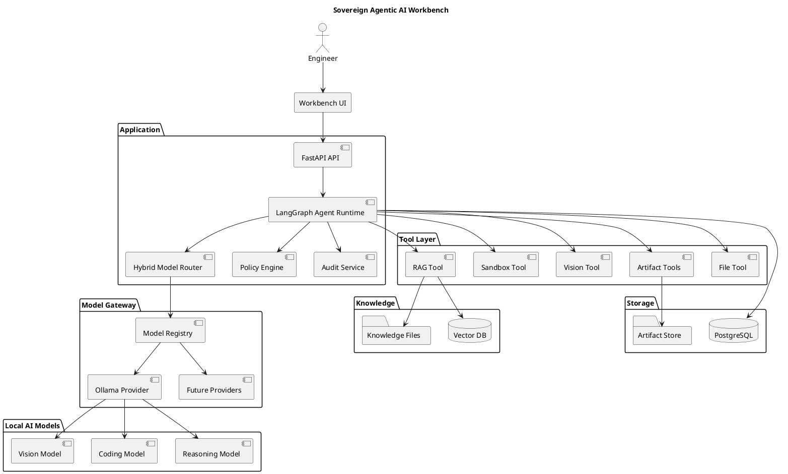

# SPEC-1 — Sovereign On-Premise Agentic AI Workbench

## Background

Refineries, PSUs, defence-linked manufacturing units, and government organizations routinely perform large volumes of knowledge-intensive engineering and administrative work involving confidential information. This includes approval notes, board presentations, engineering calculations, internal software, inspection reports, scanned drawings, financial information, vendor communications, and internal correspondence.

Cloud-based AI assistants can significantly accelerate this work, but their use is often incompatible with organizational confidentiality and data-sovereignty requirements. Sensitive documents, source code, engineering drawings, and business information cannot be sent to external AI services. Organizations therefore either perform these tasks manually or risk employees using unauthorized external AI tools.

Recent advances in open-weight reasoning and multimodal models make it practical to build useful AI assistants that operate entirely within an organization's infrastructure. However, a useful sovereign AI system requires more than local model inference. It requires agentic task execution, model selection, multimodal understanding, controlled tool access, organizational knowledge retrieval, sandboxed computation, and generation of production-ready artifacts.

This project proposes a **Sovereign On-Premise Agentic AI Workbench** that runs entirely on an organization's own GPU-enabled infrastructure and can operate in an air-gapped environment.

The workbench provides a unified interface through which engineers can delegate multi-step tasks to AI agents. A model-routing layer automatically selects an appropriate open-weight model based on task requirements while allowing new models and inference engines to be added without redesigning the agent layer.

The system can interact with local tools for file operations, knowledge retrieval, OCR, image analysis, code execution, calculations, document generation, presentation generation, and spreadsheet operations.

The system's sovereignty is treated as an architectural property. Models, prompts, source documents, tool execution, generated artifacts, and audit records remain inside the controlled environment. Network activity is monitored so that the system can demonstrate that no external AI or data-service calls occur during runtime.

The initial prototype targets a **single GPU-enabled workstation or GCP GPU VM**. The architecture is intentionally modular so it can later be deployed on larger on-premise GPU infrastructure.

---

# Requirements

## Must Have

### M1 — Sovereign Execution

* The system MUST run on a single organization-controlled GPU workstation/server.
* AI inference MUST use locally deployed open-weight models.
* The runtime MUST operate without internet access after installation and model/package provisioning.
* Confidential prompts, documents, embeddings, source code, and artifacts MUST NOT be sent to external services.
* Network activity MUST be observable and demonstrable.

### M2 — Model-Agnostic Inference

* The MVP MUST support at least two open-weight models.
* The system MUST support multiple task types, including coding and document/vision analysis.
* A model router MUST automatically select a suitable model based on task requirements.
* New models MUST be addable through configuration/adapter changes rather than changes to agent logic.
* The architecture MUST support multiple inference engines, with Ollama as the initial implementation.

### M3 — Agentic Execution

* The system MUST execute multi-step tasks rather than only generate single-turn responses.
* Agents MUST be able to plan tasks, invoke tools, observe results, and continue execution.
* Agents MUST maintain task state.
* Failed tool operations SHOULD trigger retry or replanning.

### M4 — Local Tools

The system MUST provide controlled tools for:

* File reading and writing.
* Local knowledge search.
* OCR and image analysis.
* Code execution.
* Calculations.
* Document generation.
* Presentation generation.
* Spreadsheet operations.

### M5 — Multimodal Understanding

* The system MUST process text and image-based inputs locally.
* Scanned PDFs and images MUST be supported.
* The MVP MUST demonstrate understanding of a scanned inspection/engineering document.
* OCR and vision inference MUST remain within the deployment boundary.

### M6 — Local Knowledge Base

* Users MUST be able to ingest manuals, SOPs, reports, and other authorized organizational documents.
* Agents MUST retrieve relevant information from the local knowledge base.
* Retrieved information SHOULD be traceable to source documents.

### M7 — Artifact Generation

The system MUST generate actual usable files:

* DOCX approval notes.
* PPTX presentations.
* PDF documents.
* XLSX spreadsheets.
* Source-code files.

Generated presentations SHOULD use structured layouts and visual consistency rather than raw text dumping.

### M8 — Sandboxed Coding

* Generated code MUST execute inside an isolated sandbox.
* The sandbox MUST restrict host filesystem access.
* Network access from the sandbox MUST be disabled.
* Execution output, errors, and test results MUST be captured.
* The coding agent SHOULD be capable of fixing code after failed tests.

### M9 — Auditability

The system MUST record:

* Task ID.
* User/workspace.
* Agent.
* Model selected.
* Tools invoked.
* Execution results.
* Generated artifacts.
* Approval actions.
* Timestamps.
* Network activity.

---

## Should Have

### S1 — Human Approval

High-impact actions and final sensitive deliverables SHOULD support explicit human review before completion.

### S2 — Workspace Isolation

Users/projects SHOULD have logically isolated documents, tasks, artifacts, and knowledge collections.

### S3 — Specialized Agent Skills

The system SHOULD support specialized capabilities for:

* Coding.
* Document analysis.
* Presentation generation.
* Visual analysis.
* Knowledge research.
* Approval-note generation.

### S4 — Visual/Diagram Analysis

The system SHOULD analyse engineering drawings, diagrams, photographs, and architecture diagrams.

### S5 — Artifact Validation

Generated artifacts SHOULD be rendered and validated before delivery.

---

## Could Have

* Local Git integration.
* Advanced model scheduling.
* Offline model/package registry.
* Multi-agent collaboration.
* Advanced spreadsheet analysis.
* Automatic diagram generation.
* Hardware-aware model scheduling.

---

## Won't Have in MVP

* Cloud AI APIs.
* Multi-node inference.
* Kubernetes.
* Model fine-tuning.
* Distributed agent infrastructure.
* Autonomous privileged system operations.
* Enterprise SSO.
* Complex production-grade RBAC.

---

# Method

## 1. Architectural Approach

The prototype will use a **modular monolith deployed on a single GPU node**.

Logical modules are separated through interfaces and contracts, but they do not need to become independent microservices.

The primary technology stack is:

| Layer                     | Technology                      |
| ------------------------- | ------------------------------- |
| Frontend                  | React / Next.js                 |
| API                       | FastAPI                         |
| Agent orchestration       | LangGraph                       |
| AI/tool integrations      | LangChain                       |
| Initial inference runtime | Ollama                          |
| Models                    | Open-weight local models        |
| Database                  | PostgreSQL                      |
| Vector store              | Local vector database           |
| Artifact storage          | Local filesystem/object storage |
| PPTX                      | python-pptx                     |
| DOCX                      | python-docx                     |
| XLSX                      | openpyxl                        |
| PDF                       | Local generation/rendering      |
| Code execution            | Docker sandbox                  |
| Deployment                | Docker Compose                  |

### Architectural Principle

**LangGraph and LangChain are implementation frameworks, not architectural boundaries.**

The application's own Model Gateway, Tool Registry, Policy Engine, and Artifact interfaces prevent framework or inference-engine lock-in.

---

## 2. High-Level Architecture



---

# 3. Agent Runtime

LangGraph will implement the agent state machine.

```text
User Task
   │
   ▼
CLASSIFY
   │
   ▼
PLAN
   │
   ▼
SELECT MODEL
   │
   ▼
CALL TOOL
   │
   ▼
OBSERVE
   │
   ├── Success ──────> Next Step
   │
   └── Failure ──────> Retry / Replan
                           │
                           ▼
                       VALIDATE
                           │
                           ▼
                    HUMAN APPROVAL
                           │
                           ▼
                         DONE
```

The agent state SHOULD contain:

```python
class AgentState:
    task_id: str
    user_request: str
    plan: list
    current_step: int
    messages: list
    artifacts: list
    tool_results: list
    retrieved_context: list
    selected_model: str
    approval_required: bool
    status: str
```

The graph will expose nodes such as:

```text
classify_task
plan_task
select_model
execute_tool
observe_result
validate_output
request_approval
finalize_task
```

The agent MUST NOT directly access the host operating system.

---

# 4. Hybrid Model Router

The Model Gateway sits between LangGraph/LangChain and inference engines.

```text
Agent
  │
  ▼
Model Gateway
  │
  ▼
Hybrid Router
  │
  ├── Hard Constraints
  │
  └── Candidate Scoring
          │
          ▼
       Model
```

### Model registry

```yaml
models:

  - id: reasoning
    runtime: ollama
    model: qwen3:14b
    capabilities:
      - reasoning
      - planning
      - tool_calling
    modalities:
      - text
    priority: 10

  - id: coding
    runtime: ollama
    model: coding-model
    capabilities:
      - coding
      - debugging
      - tool_calling
    modalities:
      - text
    priority: 10

  - id: vision
    runtime: ollama
    model: vision-model
    capabilities:
      - vision
      - document_understanding
    modalities:
      - text
      - image
    priority: 10
```

### Routing algorithm

**Stage 1 — Hard filtering**

Remove models that do not meet:

* Required modality.
* Required capability.
* Context requirements.
* VRAM constraints.
* Health/availability.

**Stage 2 — Scoring**

```text
score =
    capability_score
  + modality_score
  + priority
  + resource_fit
  + latency_score
```

The highest-scoring compatible model is selected.

If the model fails, the gateway selects the next compatible candidate.

---

# 5. Inference Layer

Ollama will be the first inference engine.

```text
LangChain
    │
    ▼
Model Gateway
    │
    ▼
Ollama Provider
    │
    ▼
localhost / internal Ollama API
    │
    ├── Reasoning Model
    ├── Coding Model
    └── Vision Model
```

Ollama is deliberately hidden behind a provider interface:

```python
class ModelProvider:
    async def generate(
        self,
        request: ModelRequest
    ) -> ModelResponse:
        ...
```

Future inference engines can implement the same interface.

---

# 6. Tool Architecture

Agents access tools through a central Tool Registry.

```text
Tool Registry
│
├── file.read
├── file.write
├── rag.search
├── vision.analyze
├── calculator.execute
├── spreadsheet.create
├── document.create
├── presentation.create
└── sandbox.execute
```

Each tool implements:

```python
class Tool:
    name: str
    description: str
    input_schema: dict

    async def execute(
        self,
        arguments,
        context
    ) -> ToolResult:
        ...
```

Before execution:

```text
Agent
  ↓
Tool Request
  ↓
Policy Engine
  ├── ALLOW
  ├── REQUIRE APPROVAL
  └── DENY
  ↓
Tool Execution
```

---

# 7. Local RAG Pipeline

```text
Document
   │
   ▼
Parser
   │
   ├── Native Text
   └── OCR
        │
        ▼
      Chunks
        │
        ▼
    Embeddings
        │
        ▼
     Vector DB
        │
        ▼
      Retrieval
        │
        ▼
     Reranking
        │
        ▼
     Agent Context
```

The RAG subsystem MUST remain completely local.

Every retrieved chunk SHOULD maintain source metadata:

```text
document_id
filename
page
chunk_id
content
```

This allows generated answers to reference the originating document.

---

# 8. Multimodal Processing

For scanned engineering documents:

```text
Scanned PDF
    │
    ▼
Page Extraction
    │
    ├───────────────┐
    ▼               ▼
   OCR         Page Image
    │               │
    │               ▼
    │          Vision Model
    │               │
    └───────┬───────┘
            ▼
     Structured Findings
            │
            ▼
          Agent
```

The vision subsystem can identify:

* Text.
* Tables.
* Images.
* Diagram components.
* Labels.
* Inspection findings.
* Visual anomalies.

---

# 9. Artifact-Centric Architecture

The system treats artifacts as first-class outputs rather than plain chat responses.

```text
Agent
  │
  ▼
Structured Specification
  │
  ├── ApprovalSpec
  ├── PresentationSpec
  ├── SpreadsheetSpec
  └── CalculationSpec
  │
  ▼
Artifact Generator
  │
  ▼
Final File
```

Common artifact contract:

```python
class Artifact:
    id: str
    type: str
    filename: str
    mime_type: str
    storage_uri: str
    task_id: str
    version: int
    metadata: dict
```

---

# 10. Presentation Generation

The Presentation Agent MUST NOT directly ask the LLM to manipulate PowerPoint objects.

Instead:

```text
User Request
     │
     ▼
Presentation Agent
     │
     ▼
PresentationSpec
     │
     ▼
Layout Engine
     │
     ▼
python-pptx
     │
     ▼
PPTX
     │
     ▼
Render for QA
     │
     ▼
Vision QA
     │
     ├── PASS ──> Deliver PPTX
     │
     └── FAIL ──> Revise → Render Again
```

Initial reusable layouts:

1. Title.
2. Executive summary.
3. Two-column analysis.
4. Architecture/diagram.
5. Data/chart.
6. Recommendation/decision.

The final `.pptx` is delivered to the user. Rendered images are temporary validation artifacts.

---

# 11. Coding Sandbox

```text
Coding Agent
     │
     ▼
Generated Code
     │
     ▼
Sandbox API
     │
     ▼
Docker Container
     │
     ├── Temporary filesystem
     ├── CPU/RAM limits
     ├── Execution timeout
     └── Network disabled
     │
     ▼
Tests
     │
     ├── PASS ──> Verified Code
     │
     └── FAIL ──> Agent Fixes Code
```

The sandbox MUST NOT provide privileged access to the host.

---

# 12. Sovereignty and Network Isolation

Runtime architecture:

```text
                 INTERNET
                    X
                    │
        ┌───────────┴────────────┐
        │       GPU VM           │
        │                        │
        │ UI                     │
        │ FastAPI                │
        │ LangGraph              │
        │ LangChain              │
        │ Ollama                 │
        │ RAG                    │
        │ Tools                  │
        │ Sandbox                │
        │ Database               │
        │ Artifact Store         │
        └────────────────────────┘
```

The deployment process may initially have internet access to install packages and download models.

Before runtime demonstration:

1. Models are downloaded.
2. Python dependencies are installed.
3. Container images are prepared.
4. Outbound network access is disabled.
5. Application is started.
6. Network activity is monitored.

The UI will expose:

```text
Sovereign Mode:        ENABLED
External AI Calls:     0
External API Calls:    0
Network Egress:        BLOCKED
```

The displayed values MUST be backed by actual network monitoring rather than being simulated.

---

# 13. Repository Structure

```text
sovereign-ai-workbench/
│
├── backend/
│   ├── api/
│   ├── core/
│   ├── agents/
│   ├── models/
│   ├── tools/
│   ├── knowledge/
│   ├── artifacts/
│   ├── sandbox/
│   ├── security/
│   ├── db/
│   └── schemas/
│
├── frontend/
│   ├── app/
│   ├── components/
│   └── lib/
│
├── configs/
│   ├── models.yaml
│   ├── tools.yaml
│   ├── agents.yaml
│   └── policies.yaml
│
├── prompts/
│
├── templates/
│   ├── pptx/
│   ├── docx/
│   └── approval_notes/
│
├── data/
│   ├── uploads/
│   ├── knowledge/
│   ├── artifacts/
│   └── tmp/
│
├── sandbox/
│   └── Dockerfile
│
├── scripts/
│
├── tests/
│
├── docker-compose.yml
├── .env.example
└── README.md
```

---

# Implementation

## Day 1 — Foundations

### Developer 1 — Agent + AI

* Ollama setup.
* Model Gateway.
* Model registry.
* Hybrid router.
* LangGraph skeleton.
* Basic tool-calling loop.

### Developer 2 — RAG + Vision

* PDF ingestion.
* OCR.
* Image extraction.
* Embeddings.
* Vector DB.
* Basic retrieval.

### Developer 3 — Artifacts

* DOCX generator.
* PPTX generator.
* Six reusable slide layouts.
* Basic theme.
* PresentationSpec.

### Developer 4 — Full Stack + Infrastructure

* FastAPI.
* Frontend.
* PostgreSQL.
* Docker Compose.
* File upload/download.
* Basic task API.

### Architect/Integrator

* Freeze interfaces.
* Prepare demo data.
* Define golden workflow.
* Review module integration.

---

## Day 2 — Functional Modules

### Developer 1

Complete:

* LangGraph state.
* Planning.
* Tool calls.
* Router.
* Retry/fallback.

### Developer 2

Complete:

* Scanned PDF workflow.
* Vision analysis.
* RAG search.
* Source metadata.

### Developer 3

Complete:

* PPTX generation.
* DOCX approval notes.
* PDF generation.
* Initial rendering.

### Developer 4

Complete:

* UI task workflow.
* Upload.
* Execution trace.
* Artifact downloads.

---

## Day 3 — End-to-End Integration

The entire team focuses on:

### Hero Workflow

```text
Inspection Report
        ↓
OCR / Vision
        ↓
Agent Planning
        ↓
Local RAG
        ↓
Findings
        ↓
Approval Note
        ↓
DOCX
        ↓
PresentationSpec
        ↓
PPTX
        ↓
Validation
        ↓
Download
```

The complete workflow MUST work by the end of Day 3.

---

## Day 4 — Reliability and Sovereignty

### Developer 1

* Model fallback.
* Router reliability.
* Agent retries.

### Developer 2

* Poor-quality scans.
* Vision failures.
* Retrieval quality.

### Developer 3

* PPT visual polish.
* Charts.
* Diagrams.
* Visual QA.

### Developer 4

* Network isolation.
* Audit logs.
* Docker sandbox.
* UI polish.

---

## Day 5 — Coding Agent + Demo

### Coding Workflow

```text
Requirement
    ↓
Coding Model
    ↓
Generate Code
    ↓
Docker Sandbox
    ↓
Run Tests
    ↓
FAIL → Fix → Retry
    ↓
PASS
    ↓
Verified Code
```

Final day priorities:

1. Fix integration failures.
2. Test complete workflows repeatedly.
3. Verify zero external network calls.
4. Polish UI.
5. Polish generated PPT.
6. Prepare demo data.
7. Record fallback/demo recovery paths.
8. Prepare final SIH presentation.

No major new architecture should be introduced on Day 5.

---

# Milestones

| Milestone | Target                                     |
| --------- | ------------------------------------------ |
| M1        | Ollama + models operational                |
| M2        | LangGraph agent executes a tool            |
| M3        | Local RAG operational                      |
| M4        | Vision/OCR operational                     |
| M5        | DOCX/PPTX generation operational           |
| M6        | End-to-end inspection workflow operational |
| M7        | Coding sandbox operational                 |
| M8        | Network isolation demonstrated             |
| M9        | Final UI and artifact quality              |
| M10       | Full SIH demo validated                    |

### Critical deadline

**End of Day 3:**

The complete inspection-report → analysis → RAG → approval note → PPT workflow MUST work.

If it does not, all optional features are frozen until it does.

---

# Gathering Results

The prototype will be evaluated using measurable demonstrations.

## Functional Evaluation

### Test 1 — Model Routing

Submit:

* Coding task.
* Document/vision task.

Verify that different appropriate models are automatically selected.

### Test 2 — Multimodal Agent

Provide a scanned inspection report.

Measure:

* OCR success.
* Finding extraction.
* Relevant knowledge retrieval.
* Generated recommendation.

### Test 3 — Artifact Generation

Verify:

* DOCX opens correctly.
* PPTX opens correctly.
* PDF is readable.
* Generated content corresponds to source material.

### Test 4 — Coding Agent

Measure:

* Code generation.
* Sandbox execution.
* Test results.
* Automatic correction after failure.

### Test 5 — Sovereignty

During the complete demonstration:

```text
External AI/API Calls: 0
Unauthorized Network Egress: 0
```

Network monitoring and audit logs will provide evidence.

## Agent Evaluation

The execution trace will be evaluated for:

* Correct model selection.
* Correct tool selection.
* Successful multi-step planning.
* Recovery from tool failures.
* Appropriate human approval.
* Correct artifact generation.

## Performance Evaluation

The prototype will record:

* Time to first response.
* Total task completion time.
* Model inference latency.
* Number of agent steps.
* Tool execution latency.
* RAG retrieval latency.
* Artifact generation time.
* GPU memory utilization.

## Primary Demonstration

The primary SIH demonstration will be:

> **Upload a confidential scanned industrial inspection report → locally analyse the document using OCR and vision → retrieve relevant organizational SOPs → reason over the findings → generate an approval note → generate a professional PPTX → validate the generated artifacts → provide downloadable deliverables while visibly demonstrating zero external network calls.**

A secondary demonstration will show:

> **Engineering requirement → coding model → sandbox execution → failed test → automatic correction → verified code.**

Together these demonstrate the core properties of the proposed sovereign workbench: **local inference, multimodal understanding, model routing, agentic execution, local knowledge grounding, secure tool use, artifact generation, validation, and demonstrable sovereignty.**

---

# Need Professional Help in Developing Your Architecture?

Please contact me at [sammuti.com](https://sammuti.com) :)

---

# Current Project Scaffold

The repository now includes an executable foundation for the architecture above.

```text
backend/             FastAPI API, agent state/runtime, model gateway, tool and policy contracts
configs/             Model, tool, agent, and policy configuration
frontend/            Minimal Next.js task-submission UI
sandbox/             Non-root sandbox image foundation
data/                Local uploads, knowledge, artifacts, and temporary-work directories
tests/               Initial model-routing tests
```

## Start locally

```bash
cp .env.example .env
python -m venv .venv
.venv/bin/pip install -r requirements.txt pytest
.venv/bin/uvicorn backend.main:app --reload
```

Then open `http://localhost:8000/docs`. The scaffold exposes `GET /api/v1/health`,
`GET /api/v1/models`, and `POST /api/v1/tasks`. A task is planned and routed from
local configuration only; model generation, tool execution, storage, RAG, and
artifact implementations remain intentionally separate adapters to complete next.

To run the initial routing checks:

```bash
.venv/bin/pytest
```
